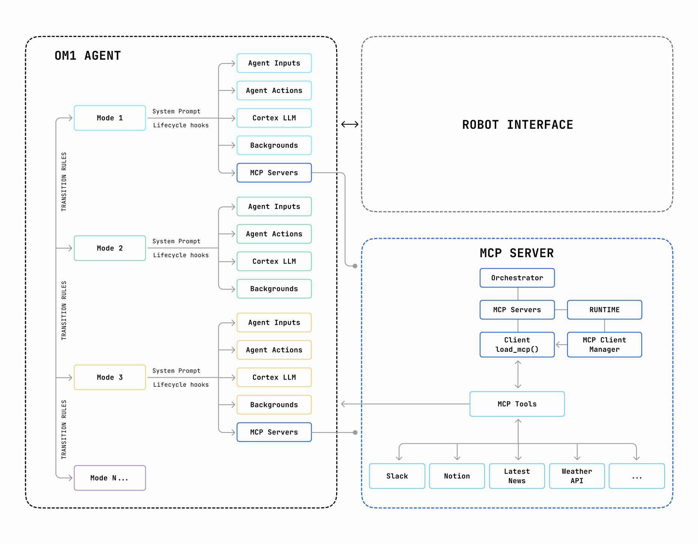

OM1 agents can now connect to external tools like Slack, Notion, weather APIs, and more — all through the Model Context Protocol (MCP). No custom integrations required.

## What is MCP?

MCP is an open standard that lets AI agents discover and use tools dynamically. Think of it as **USB for AI** — plug in a server, and your agent instantly knows what tools are available.

## Architecture



### Key Components

| Component | Description |
|-----------|-------------|
| **OM1 Agent** | The main agent runtime for the machine |
| **Modes** | Each mode can have its own MCP servers, system prompt, inputs, and actions |
| **MCP Servers** | Per-mode configuration that defines which external tools are available in that particular mode|
| **Orchestrator** | Coordinates communication between the agent and external services |
| **MCPClientManager** | Manages connections to MCP servers, discovers tools, and routes tool calls |
| **MCP Tools** | External services like Slack, Google Maps, Weather APIs, Notion, and more |
| **Robot Interface** | Physical or simulated robot that interacts with the real world |

### Per-Mode MCP Servers

Each mode operates independently with its own set of MCP servers. For example:

```
Mode 1 ──► [Slack, Google Maps]     ──► MCPClientManager instance 1
Mode 2 ──► [Weather, News]          ──► MCPClientManager instance 2
Mode 3 ──► (no MCP servers)         ──► Offline mode
```

This enables:
- **Isolation**: Different modes access different tools
- **Flexibility**: Hot-swap capabilities without code changes

### Install Node

MCP servers typically run via `npx`, which requires Node.js to be installed.

Check if you already have it installed by running the following commands -

```bash
node --version
npm --version
```

If you don't have node installed on your system, follow the steps [here](https://nodejs.org/en/download/current).

### Add MCP Servers to Your Config

| Field | Type | Required | Description | Example |
|-------|------|----------|-------------|---------|
| `name` | *string* | Required | Server identifier | `"google-maps"` |
| `transport` | *string* | Required | How to connect: `stdio` (subprocess), `sse` (streaming), or `http` (request/response) | `"stdio"` |
| `command` | *string* | Required | Executable to launch | `"npx"` |
| `args` | *array* | Optional | Arguments for the command | `["-y", "@modelcontextprotocol/server-google-maps"]` |
| `env` | *object* | Optional | Environment variables required by the server (e.g., API keys, tokens) | `{"API_KEY": "your-api-key"}` |
| `url` | *string* | Required for `sse`/`http` | Server endpoint URL | `"http://localhost:3000/sse"` |
| `headers` | *object* | Optional | HTTP headers for `sse`/`http` transport | `{"Authorization": "Bearer token"}` |

## How It Works

```
┌─────────────────────────────────────────────────────────────┐
│                        OM1 Agent                            │
│                                                             │
│   Config ──► load_mcp() ──► MCPClientManager                │
│                                   │                         │
│                                   ├── Discovers tools       │
│                                   ├── Manages connections   │
│                                   └── Executes tool calls   │
└─────────────────────────────────────────────────────────────┘
                              │
                              ▼
                ┌─────────────────────────┐
                │     MCP Servers         │
                │  (Slack, Maps, etc.)    │
                └─────────────────────────┘
```

1. **Configuration**: MCP servers are defined in your mode's config file
2. **Initialization**: `MCPClientManager` launches and connects to each server
3. **Discovery**: Tools are automatically discovered from connected servers
4. **Execution**: When the LLM decides to use a tool, `MCPClientManager` routes the call

Example config file [conversation_mcp](https://github.com/OpenMind/OM1/blob/main/config/conversation_mcp.json5)

## Available MCP Servers

Browse community-maintained MCP servers:

- [Official MCP Servers](https://github.com/modelcontextprotocol/servers)
- Slack, GitHub, Google Maps, Filesystem, and many more

## Next Steps

- [Configuration Guide](../core-concepts/3_configuration.md) — Learn more about OM1 config files
- [MCP Specification](https://modelcontextprotocol.io) — Official MCP documentation
