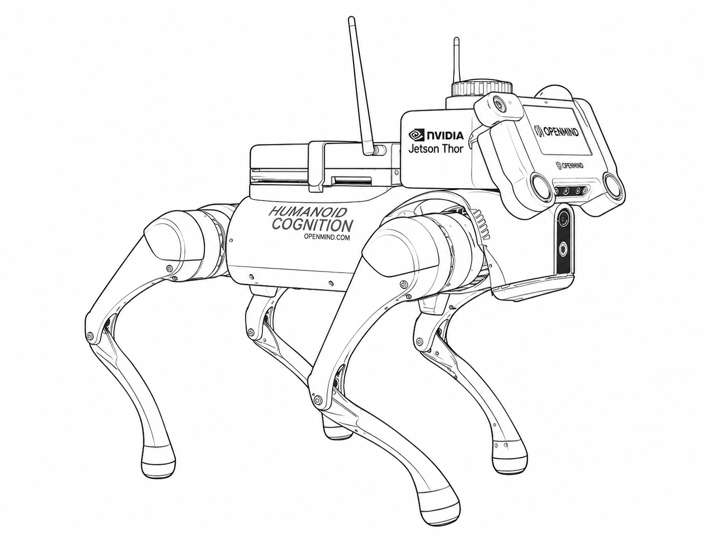

## Overview

From research to real-world autonomy, the **OM1 BrainPack** is a plug-and-play module that brings full autonomy to your robots.

The BrainPack is designed to be mounted directly onto a robot to bring together mapping, object recognition, remote control, and self-charging capabilities — giving humanoids and quadrupeds what they need to navigate, remember, and act with purpose.

> The BrainPack makes your robot smarter — a system that **learns, moves, and builds with you.**

## Key Features

| Feature | Description |
|---------|-------------|
| **NVIDIA Thor** | Provides powerful GPU compute for AI inference and navigation |
| **JetPack 7.0** | Latest NVIDIA software stack with optimized ML libraries |
| **ROS2 Support** | Compatible with current and future versions of ROS2 |
| **Robot Agnostic** | Control different robot form factors (quadrupeds, humanoids) |
| **Connectivity** | Ethernet, USB, and multiple power options |
| **Open Reference Design** | Build your own with published specifications |

## Hardware Specifications

Each BrainPack comes with:

- NVIDIA Thor compute module
- Integrated speakers for TTS output
- Multiple connectivity options (Ethernet, USB)
- Flexible power input options
- Mounting hardware for Unitree robots

## Supported Robots

| Robot | Support Level |
|-------|---------------|
| Unitree Go2 | ✅ Fully Supported |
| Unitree G1 | ✅ Fully Supported |
| LimX Tron | ✅ Fully Supported |

## Next Steps

The BrainPack is open-source and you can refer to the guidelines to build your own [here](https://github.com/OpenMind/brainpack).
