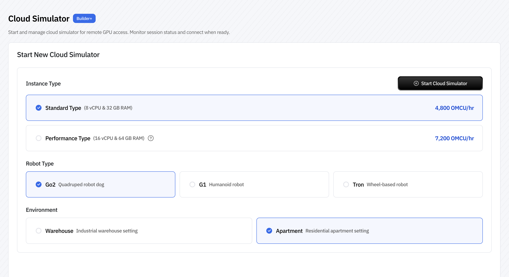
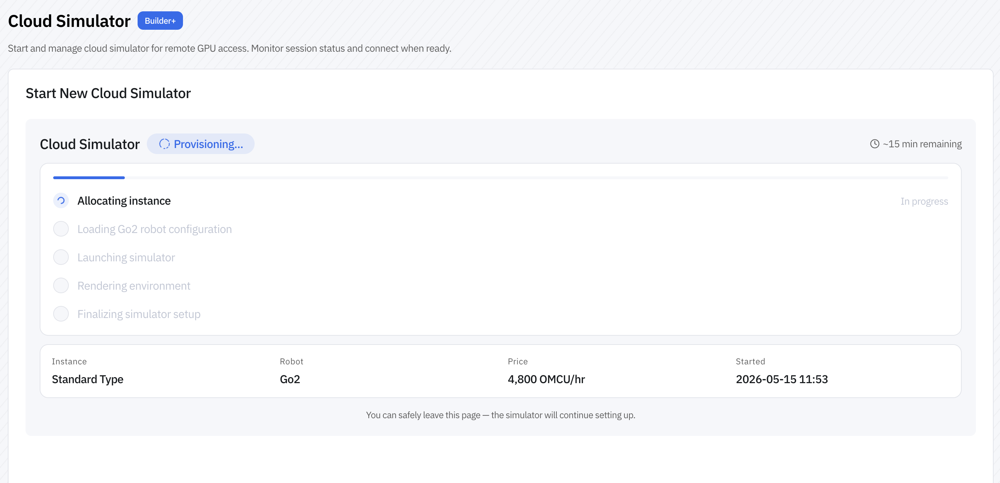
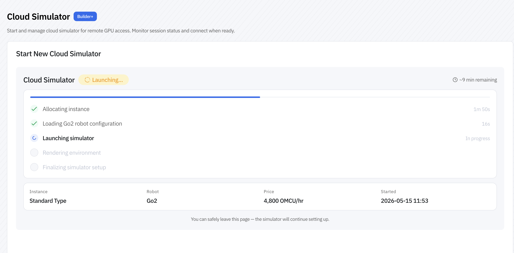
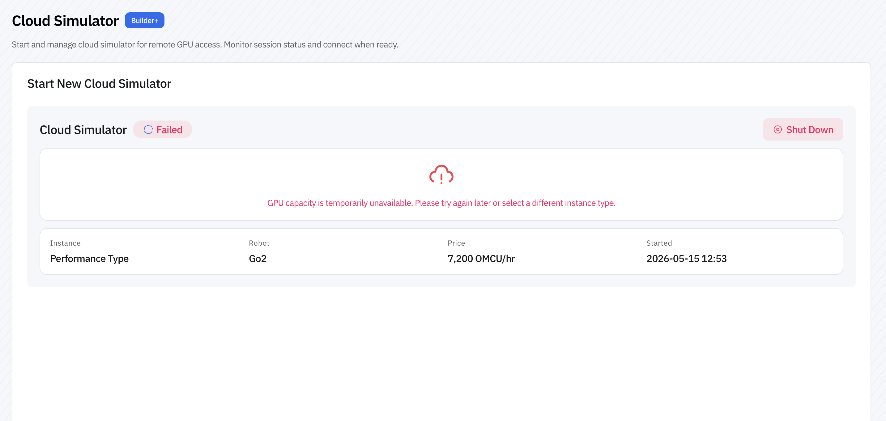
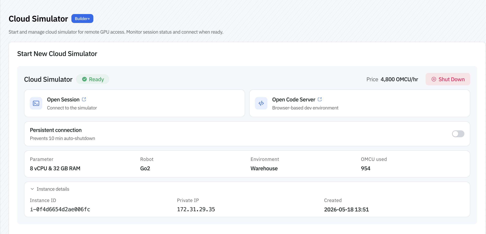
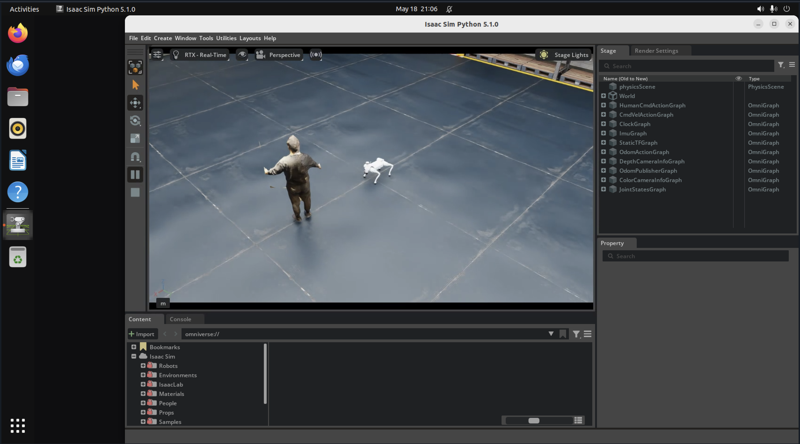
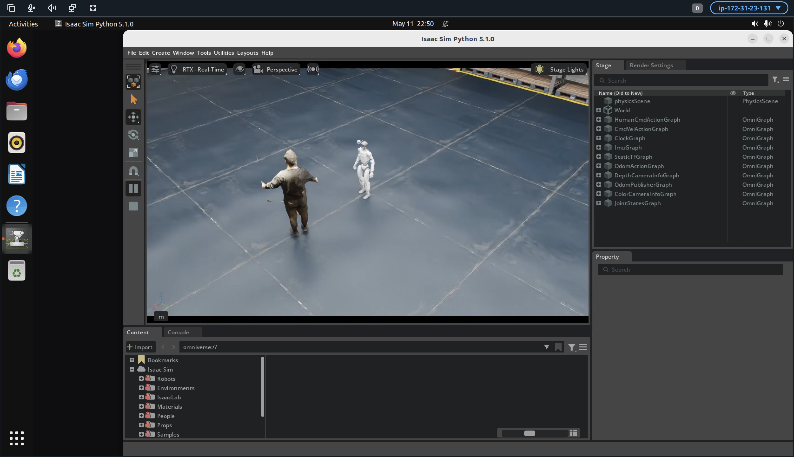
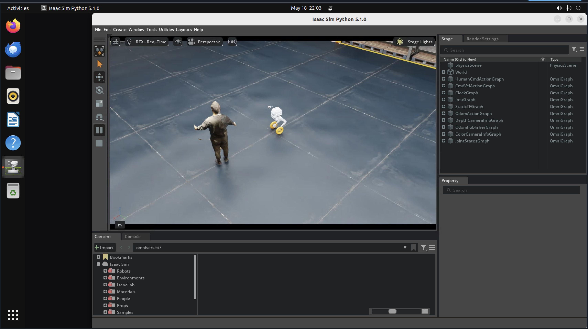
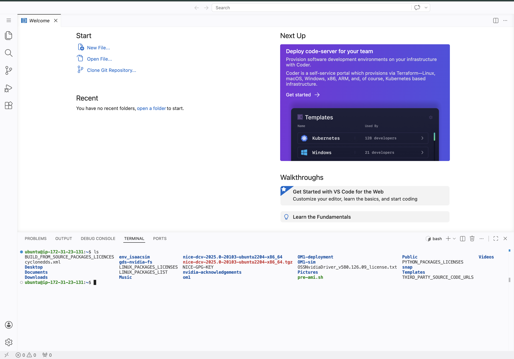
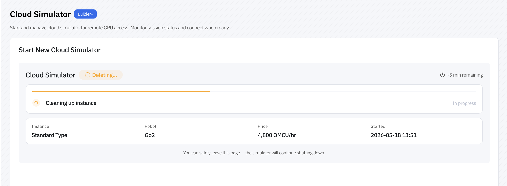

## Cloud Isaac Sim Developer Walkthrough

Cloud Isaac Sim enables you to run robot simulations on managed cloud infrastructure, fully integrated with OM1. This guide walks you through launching an instance and connecting your OM1 setup.

## Prerequisites

- OpenMind Portal account on **Builder plan** or higher (required for Cloud Simulator access)
- API key (found in your portal)
- OM1 codebase with `uv` environment configured

## Cost & Billing

Cloud Simulator usage is billed in OMCU (OpenMind Compute Units). Billing begins as soon as an instance is **allocated** and stops only when the instance is deleted. Ensure your account has sufficient balance before launching.

A **Builder plan** or higher is required to access the Cloud Simulator. Check your OMCU balance and plan in the [OpenMind Portal](https://portal.openmind.com) dashboard before starting.

## Step 1: Launch a Cloud Simulator Instance

1. Log in to the [OpenMind Portal](https://portal.openmind.com)
2. Navigate to **Cloud Simulator** from the sidebar

### Instance Types

Choose based on your simulation workload:

| Instance Type | vCPUs | RAM | Best For | Price (Per Hour) |
|---|---|---|---|---|
| **Standard** | 8 | 32 GB | Development & testing | 4800 OMCU |
| **Performance** | 16 | 64 GB | Heavy compute, multi-robot scenarios | 7200 OMCU |



### Supported Robots

- Unitree Go2
- Unitree G1
- LimX Tron

### Available Environments

- Warehouse
- Apartment

### Launch Time

The instance goes through the following stages before it is ready:

1. Allocating Instance
2. Load Robot Configuration
3. Launching Simulator
4. Render Environment
5. Finalizing Simulator Setup

> **Note**: Expect **10-15 minutes** for your instance to fully initialize.

Once you initiate the launch, the system begins setting up your cloud environment.





The instance is ready when the status changes to **Running**.

> **Note**: If the requested GPU is not available, you will see the error below. Wait a few minutes and try again, or switch to a different instance type.



## Step 2: Access your Active Cloud Isaac Sim Session

View your running session from the portal dashboard.



Click on Open Session. The simulator view will reflect the robot you selected when launching the instance:

Unitree Go2:



Unitree G1:




LimX Tron:



## Step 3: Run OM1 with Cloud Simulator

Two options are available once your instance is running:

### Option A: Cloud VS Code

Access a full VS Code environment running in the cloud with OM1 pre-configured.



From here, you can:
- Edit and run OM1 code directly in the cloud
- Execute `uv run` commands without local hardware
- Test and debug your robot behaviors

### Option B: Local Environment

Run OM1 on your local machine and connect to the cloud simulator:

1. Copy your **API Key** from the portal and ensure `OM_API_KEY` is set in your environment or `.env` file.
2. Open `config/cloud_sim.json5` in your local OM1 repo. This config targets a Unitree Go2 in the cloud simulator with voice input, VLM, and autonomous movement. You can adjust the `system_prompt_base`, robot inputs, and actions to match your use case.
3. Run the config:

```bash
uv run src/run.py cloud_sim
```

## Cleaning Up

When you're finished with your simulation:

1. Return to the Cloud Simulator dashboard
2. Click **Delete Instance**



3. Confirm the deletion — this stops billing and frees cloud resources

## What's Next?

- Explore [unitree_go2_modes_cloud config](https://github.com/OpenMind/OM1/blob/main/config/unitree_go2_modes_cloud.json5) to try multi modes in cloud sim
- Read the [Configuration Guide](../developing/3_configuration.md) to modify inputs, actions, and prompts in `cloud_sim.json5`
