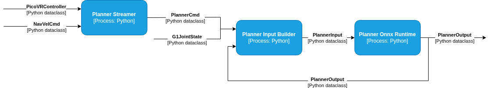

# GearSonic Planner

GearSonic locomotion trajectory planner. Generates full-body reference trajectories at ~2Hz from operator commands, which feed into the GearSonic encoder/decoder policy at 50Hz.

## Architecture

## Locomotion Modes

| mode | name |
|---|---|
| 0 | `IDLE` |
| 1 | `SLOW_WALK` |
| 2 | `WALK` |
| 3 | `RUN` |
| 4 | `IDLE_SQUAT` |
| 5 | `IDLE_KNEEL_TWO_LEGS` |
| 6 | `IDLE_KNEEL` |
| 7 | `IDLE_LYING` |
| 8 | `IDLE_CRAWLING` |
| 9 | `IDLE_BOXING` |
| 10 | `WALK_BOXING` |
| 11 | `LEFT_PUNCH` |
| 12 | `RIGHT_PUNCH` |
| 13 | `RANDOM_PUNCH` |
| 14 | `ELBOW_CRAWLING` |
| 15 | `LEFT_HOOK` |
| 16 | `RIGHT_HOOK` |
| 17 | `FORWARD_JUMP` |
| 18 | `STEALTH_WALK` |
| 19 | `INJURED_WALK` |

## Model

| model | description |
|---|---|
| `planner_sonic.onnx` | locomotion trajectory planner |

### Input

| field | shape | type | description |
|---|---|---|---|
| `context_mujoco_qpos` | `[1, 4, 36]` | float32 | robot state history — 4 frames × 36 (7 floating base + 29 joints in isaaclab order) |
| `target_vel` | `[1]` | float32 | target speed m/s (−1 = model default) |
| `mode` | `[1]` | int64 | locomotion mode: see Locomotion Modes |
| `movement_direction` | `[1, 3]` | float32 | direction to move (unit vector) |
| `facing_direction` | `[1, 3]` | float32 | direction to face (unit vector) |
| `random_seed` | `[1]` | int64 | random seed for stochastic generation |
| `has_specific_target` | `[1, 1]` | int64 | specific waypoint target: 0=no, 1=yes |
| `specific_target_positions` | `[1, 4, 3]` | float32 | 4 waypoint positions xyz |
| `specific_target_headings` | `[1, 4]` | float32 | 4 waypoint heading angles |
| `allowed_pred_num_tokens` | `[1, 11]` | int64 | prediction token mask (default: [1,1,1,1,1,1,0,0,0,0,0]) |
| `height` | `[1]` | float32 | target body height in meters (−1 = model default) |

### Output

| field | shape | type | description |
|---|---|---|---|
| `mujoco_qpos` | `[1, 64, 36]` | float32 | future trajectory — 64 frames × 36 (7 floating base + 29 joints in isaaclab order), 30Hz |
| `num_pred_frames` | `[1]` | int32 | number of valid predicted frames |
